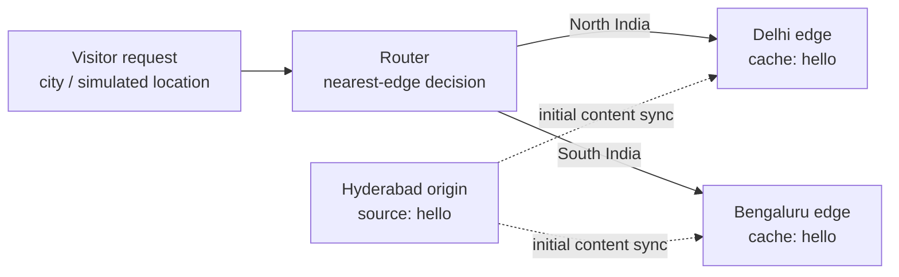

# Product Design Requirements — CDN Routing Simulator

**Status:** Superseded by `docs/PRD.md` · **Project type:** historical design exploration · **Scope:** local simulation

> This two-edge simulation proposal is retained for design history. The implemented product follows the three-region router architecture in the PRD and exposes live routing decisions in the browser.

## 1. Product snapshot

Build a small Content Delivery Network (CDN) simulator that demonstrates one core CDN decision: send a visitor to the closest available edge server. One **origin server** owns the original content and two **edge servers** cache the same response:

| Node | City | Purpose |
| --- | --- | --- |
| Origin | Hyderabad | canonical source of `hello-from-origin` |
| South edge | Bengaluru | serves southern India requests |
| North edge | Delhi NCR | serves northern India requests |

The browser demo lets a reviewer choose a request city and watch the routing path. The C++ program prints the same decision in the terminal.

## 2. Problem and opportunity

An origin located far from a visitor adds unnecessary network distance and latency. A CDN places cached copies near groups of users, routes each request to an appropriate point of presence (PoP), and keeps the application responsive.

This project makes that idea tangible without hiding it behind cloud services. It gives an interviewer a concrete starting point to discuss edge caching, routing, cache invalidation, failover, and how a local prototype would evolve in production.

## 3. Goals

1. Simulate request routing across one origin and two Indian edge servers.
2. Pick the nearest edge using a deterministic city/region mapping.
3. Return identical content from both edges and visibly identify the serving node.
4. Provide a browser visualization that makes the request path understandable in under 30 seconds.
5. Keep the core C++ implementation intentionally small: roughly 6–7 focused source/header files.

## 4. Non-goals

- Accurate street-level geolocation or live IP lookup.
- Real distributed infrastructure, TLS, anycast, DNS routing, or global load balancing.
- Replication protocols, cache eviction algorithms, billing, authentication, or DDoS protection.
- Claiming production CDN performance from a local simulator.

## 5. User stories

**Recruiter / interviewer:** As a reviewer, I can choose Delhi or Bengaluru and immediately see why a different edge responds.

**Student developer:** As a builder, I can run the project locally, send a request with a selected location, and trace the routing result in the console.

**Future operator:** As an extender, I can add a city, server, or fallback rule without rewriting the routing engine.

## 6. Proposed architecture

### Suggested 7-file C++ shape

| File | Responsibility |
| --- | --- |
| `main.cpp` | starts the simulation and accepts routing requests |
| `models.h` | `Location`, `Server`, and `Response` data structures |
| `locations.cpp` | known city coordinates / lookup data |
| `distance.cpp` | distance calculation (Haversine or simplified distance) |
| `router.cpp` | selects the nearest healthy edge |
| `server.cpp` | simulates origin and edge responses |
| `logger.cpp` | formats the request path and latency output |

The current static server can remain the local browser host; the files above are the clean next structure for the routing simulator.

## 7. Functional requirements

| ID | Requirement | Acceptance criteria |
| --- | --- | --- |
| FR-1 | Define one origin and two edge nodes. | Bengaluru and Delhi edges plus Hyderabad origin appear in configuration/output. |
| FR-2 | Route a request to the nearest healthy edge. | Bengaluru routes to Bengaluru; Delhi routes to Delhi. |
| FR-3 | Serve consistent content. | Every successful response includes the same payload, `hello from the CDN cache`. |
| FR-4 | Expose routing evidence. | Response/output includes request city, selected edge, estimated distance, and cache status. |
| FR-5 | Handle an unavailable edge. | If the nearest edge is marked unhealthy, route to the next nearest healthy node or origin. |
| FR-6 | Visualize the simulation. | Browser UI highlights the request city, animated route, selected edge, and response metadata. |

## 8. Routing rules

1. Read the simulated request location (for v1, a city selected by the user).
2. Filter to healthy edge nodes.
3. Calculate distance from request location to each edge.
4. Select the lowest-distance edge.
5. If no edge is healthy, return content from origin and mark the result as an origin fallback.

### Example scenarios

| Visitor location | Expected node | Reason |
| --- | --- | --- |
| Bengaluru / Karnataka | Bengaluru edge | closest southern PoP |
| Chennai / Tamil Nadu | Bengaluru edge | closest available southern PoP in v1 |
| Delhi / Punjab / Uttar Pradesh | Delhi edge | closest northern PoP |
| Both edges offline | Hyderabad origin | safe fallback preserves availability |

## 9. Experience and visual requirements

- The landing view must show the three-node network, not just describe it in text.
- A requester can choose at least Bengaluru, Chennai, Delhi, Mumbai, and Hyderabad.
- “Route request” must update the serving node, route description, estimated latency, and response card without reloading.
- Use explicit language: this is a **simulation**, and latency/distance are illustrative.
- Keep keyboard controls usable and respect reduced-motion preferences.

## 10. Quality targets

- A route decision completes synchronously in under 10 ms locally.
- The core simulation has no third-party C++ dependencies.
- Repeated requests for the same city produce the same result.
- Manual verification covers the two primary paths and the all-edges-unavailable fallback.
- The browser demo remains readable at 360 px wide.

## 11. Milestones

1. **Model (day 1):** define location/server data and print a fixed request path.
2. **Routing (day 2):** calculate nearest healthy edge and document manual verification scenarios.
3. **Resilience (day 3):** add edge-health toggle and origin fallback.
4. **Storytelling (day 4):** add the interactive browser visualization and README screenshots.

## 12. Resume-ready description

> Built a C++ CDN routing simulator with an origin and regional India edge nodes; implemented nearest-node selection, consistent cached responses, and origin fallback, with an interactive visualization of request routing and latency trade-offs.

## 13. Open decisions

- Should v2 use actual latitude/longitude and Haversine distance, or retain a simple regional mapping for maximum clarity?
- Which two request failures should be simulated first: edge outage, cache miss, or origin outage?
- Should the browser UI read the C++ server response directly in v2, or remain a standalone visual companion?
