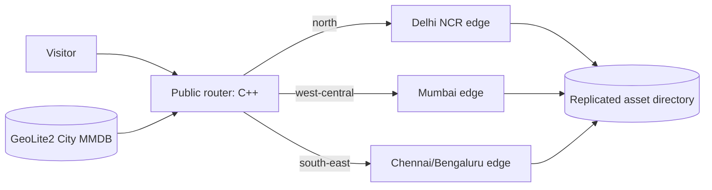

# PRD — India Regional CDN

**Status:** Implemented prototype  
**Product:** Simple CDN  
**Primary outcome:** Serve an asset from the correct India edge automatically, without asking the visitor for their location.

## 1. Problem

The existing prototype asks the browser to reveal a device location and then redirects with JavaScript. That is not CDN routing: it is slow, requires permission, exposes more location data than needed, and chooses an edge only after the first page loads.

We need server-side routing based on the request IP. The browser should request one public CDN URL and receive the asset from the assigned regional edge transparently.

## 2. Goals

1. One public URL for all static assets, for example `https://cdn.example.in/logo.png`.
2. Automatically route a request to one of three India regions before content is returned.
3. No browser geolocation prompt, state selector, or client-side redirect.
4. Keep the edge server in C++ and dependency-light.
5. Provide a local setup that is easy to run without external infrastructure.
6. Include cache headers, health checks, MIME types, CORS, safe path resolution, request logs, and a regional response header.

## 3. Non-goals (v1)

- Building a worldwide anycast network.
- Replicating files automatically across data centres.
- TLS certificate provisioning inside the C++ process.
- DDoS protection, WAF, billing, or analytics dashboards.
- Perfect IP-to-state precision. IP geolocation is an estimate; routing must gracefully fall back to a default edge.

## 4. Users and user stories

**Website visitor**

> As a visitor in Maharashtra, I request one CDN URL and receive the asset from the West/Central edge without granting location permission.

**Operator**

> As an operator, I can run three edge nodes and one router, change their addresses in one config file, and see which edge served a request.

**Developer**

> As a developer, I can inspect the routing decision locally by supplying a development-only region header.

## 5. Region model

| Key | Suggested location | Coverage |
| --- | --- | --- |
| `north` | Delhi NCR | North India |
| `west-central` | Mumbai | West and Central India |
| `south-east` | Chennai or Bengaluru | South and East India |

The router derives the client subdivision (state/UT) from a local GeoLite2 City-compatible MMDB database and maps it to one of these region keys. An unknown, unavailable, or non-India address falls back to a configurable default, initially `north`.

## 6. Architecture



### Components

- **Router:** accepts the public HTTP request, extracts the original client IP, resolves it through the local MMDB database, selects an edge, and reverse-proxies the request.
- **Edge:** serves static files only. It trusts the router only over the private network and emits `X-CDN-Edge-Region`.
- **GeoIP data:** MaxMind GeoLite2 City (or a paid MaxMind City database), updated on a schedule by operations—not downloaded per request.

## 7. Functional requirements

| ID | Requirement | Acceptance criterion |
| --- | --- | --- |
| FR-1 | Route by source IP on the server. | A normal browser request never receives a location prompt. |
| FR-2 | Use the IP from a trusted proxy only. | Router ignores `X-Forwarded-For` from untrusted public clients. |
| FR-3 | Reverse-proxy to the selected edge. | A request returns the selected edge’s response and `X-CDN-Edge-Region`. |
| FR-4 | Fallback safely. | Unknown/invalid IP and unavailable GeoIP data return from the configured default edge. |
| FR-5 | Support three regions. | Config can define North, West/Central, South/East endpoints independently. |
| FR-6 | Provide local route inspection. | A development-only region override exercises every route without a real GeoIP lookup. |
| FR-7 | Preserve static-server protections. | Traversal attempts are rejected and files outside the asset root are never served. |

## 8. Non-functional requirements

- **Latency:** router decision target under 5 ms with an open local MMDB database; proxy overhead under 10 ms on a local network.
- **Availability:** no GeoIP lookup failure may make content unavailable; use the default edge.
- **Privacy:** use IP only for transient routing; no location is sent to browser JavaScript or third-party geocoding service.
- **Observability:** structured line log includes request path, selected edge, decision source (`geoip`, `default`, or `dev-override`), status, and duration.
- **Security:** edge endpoints require router authentication and reject unsafe paths.

## 9. Configuration contract

One config file declares:

```toml
[router]
listen = "0.0.0.0:8080"
default_region = "north"
geoip_database = "/var/lib/cdn/GeoLite2-City.mmdb"
trust_proxy = "10.0.0.0/8"
development_allow_client_ip_override = false

[edges.north]
url = "http://10.10.1.10:8080"
[edges.west-central]
url = "http://10.20.1.10:8080"
[edges.south-east]
url = "http://10.30.1.10:8080"
```

Local development points these URLs at `localhost` ports.

## 10. Delivery plan

1. **Foundation:** remove browser geolocation UI; keep the default page as a neutral status page.
2. **GeoIP resolver:** add a C++ wrapper around `libmaxminddb` with deterministic local fallback behavior.
3. **Router:** add streaming reverse proxy, endpoint config, timeouts, fallback, trusted-proxy policy, and decision headers.
4. **Edge hardening:** retain static serving and add router-only trust mode plus logs.
5. **Operations:** shell scripts for four local services and documented manual checks for all region/fallback routes.

## 11. Success metrics

- 100% of normal browser requests complete without a location prompt.
- Every request includes `X-CDN-Edge-Region`.
- Manual checks cover North, West/Central, South/East, unavailable GeoIP, and unavailable selected edge.
- An operator can run the local four-service system from the README in under five minutes.

## 12. Future considerations

1. Choose a hosting environment if the prototype is later moved beyond local development.
2. Choose a domain and TLS termination approach for public use.
3. Choose GeoLite2 City or MaxMind GeoIP City based on precision and licensing needs.
4. Define the desired fallback edge and expected traffic volume.
